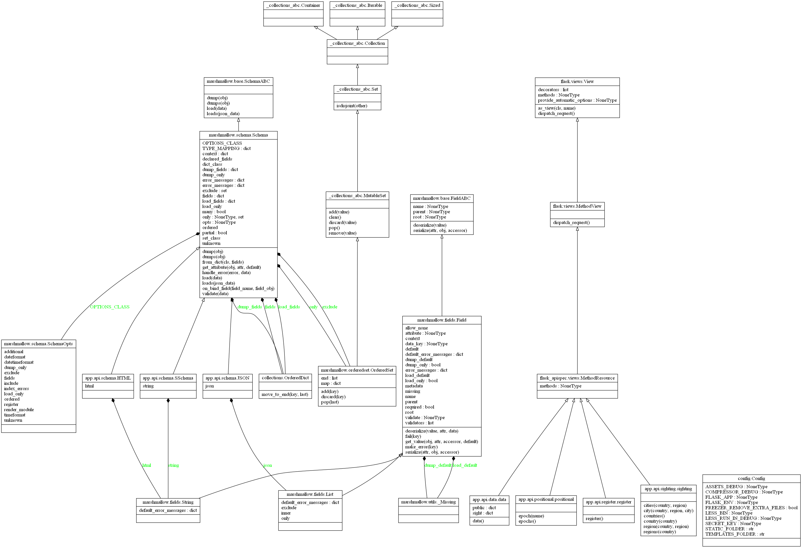
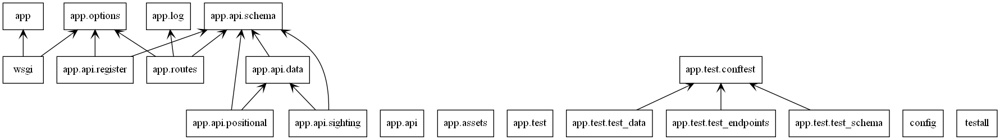
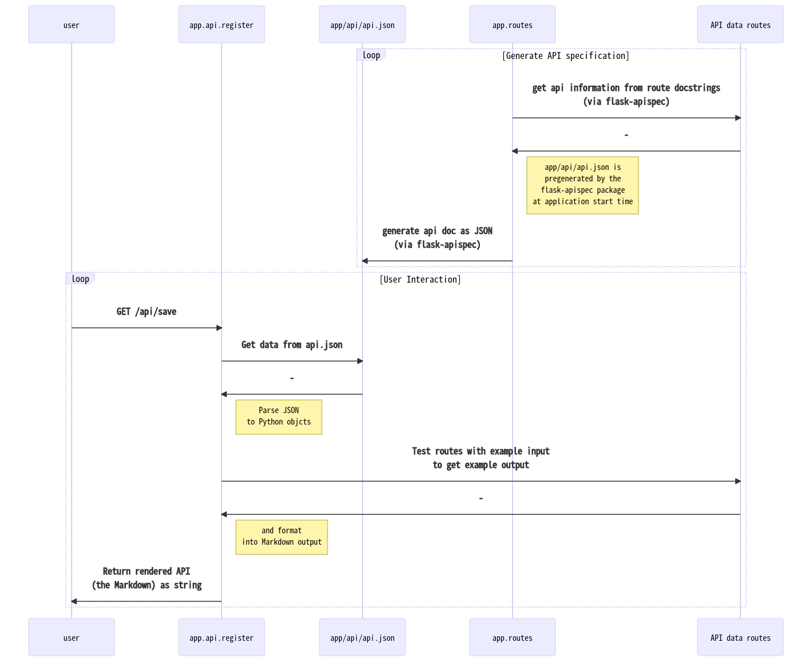

<h1 align="center">positional-iss : documentation generator schematic</h1>

  <b>A description of the documentation system / API-Spec (application programming interface specification) generator in the <a href='https://github.com/akhilsadam/positional-iss'>positional-iss</a> project. HW07 for COE332.</b> 
  

 

# Introduction and Basic Overview

This document assumes familiarity with the <a href='https://github.com/akhilsadam/positional-iss'>positional-iss</a> project, so if you have not read the project documentation, please do that first. <b>Notes from that document will <i>not</i> be re-included here.</b>

<embed style='background:rgba(77,143,172,0.5);'>

! With that said, a basic reminder: Every route in the application can be called by either entering the corresponding URL in a browser or using the command-line utility (cli) `curl`.

</embed>

We begin by considering the front-end methods / routes that arise in the application. An auto-generated inheritance diagram, and then an interaction diagram follows. (Note only specific details will be covered here --- those in relation to documentation generation.)

We see that the `app.api.data.data` class has two variables and one callable route `data()`, which is a HTTPS `POST` endpoint (i.e. it updates the ISS position and sighting data when called by the appropriate `curl` command, which is listed in the API specification in the project documentation.)  
Similarly, the `app.api.positional.positional`,`app.api.sighting.sighting`, and `app.api.register.register` classes contain their corresponding route definitions, so that the user may interact with their routes. All of these classes inherit from the `flask_apispec.views.MethodResource` type, since they are each a particular set of callable routes that are part of the API.  

Now for the interaction diagram. 

Notice that `app.api.positional` and `app.api.sighting` both talk to `app.api.data` (represented by the arrow), since they request data from `app.api.data` to return to the user whenever a route is called.

As the general layout is now defined, consider the `app.api.register`. This module generates the documentation from the API, as seen below.

# Documentation System

Below is a sequence diagram illustrating the process of documentation generation.

First, before the user (left-most object) performs any action, the `app.routes` module initalizes the documentation with the help of the `flask-apispec` package. The `app.routes` module, via the `flask-apispec` package, parses the api information from documentation strings in the route code files (here noted as `API data routes`), and saves it to a file called `app/api/api.json`, which can be navigated to and downloaded.  

Now consider the user. When the user uses the `curl` utility or a browser to navigate to `/api/save`, a HTTP `GET` request is sent to the `app.api.register` module, which requests the pre-generated `api.json` file (also a HTTP request), and converts that to Python objects. Particularly, the module parses out the example input commands and creates a `curl` command to test the route.

Then it calles the appropriate route and collects the example output. (In this diagram all API data routes are clustered together as `API data routes` for simplicity.) 
With the example data, the API specification is now complete. The `app.api.register` module now formats everything into a simple Markdown file, which is then returned to the user as a string.

Thank you for reading!

##  Contributors
	

| [Akhil Sadam](https://github.com/akhilsadam) |
|:----------------------------------------------:|

##  License
	
Licensed under [MIT](https://opensource.org/licenses/MIT).